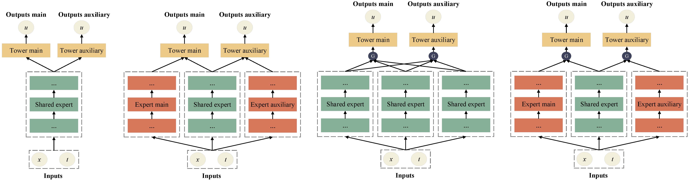
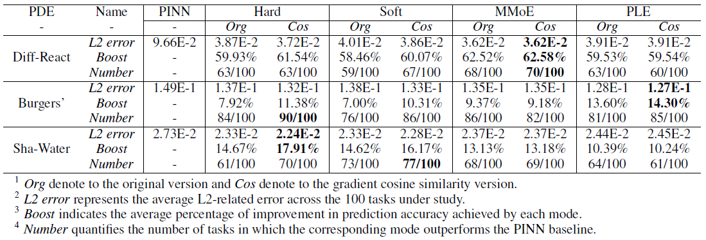

# ALT-PINN

An official source code for paper [Auxiliary-Tasks Learning for Physics-Informed Neural Network-Based Partial Differential Equations Solving](https://arxiv.org/abs/2307.06167), submitted to IEEE Transactions on Neural Networks and Learning Systems, TNNLS. Any communications or issues are welcomed. Please contact shuaicaijunjun@126.com. If you find this repository useful to your research or work, it is really appreciate to star this repository. :heart:

-------------

### Overview

<p align = "justify"> 
Physics-informed neural networks (PINNs) have emerged as promising surrogate modes for solving partial differential equations (PDEs). Their effectiveness lies in the ability to capture solution-related features through neural networks. However, original PINNs often suffer from bottlenecks, such as low accuracy and non-convergence, limiting their applicability in complex physical contexts. To alleviate these issues, we proposed auxiliary-task learning-based physics-informed neural networks (ATL-PINNs), which provide four different auxiliary-task learning modes and investigate their performance compared with original PINNs. We also employ the gradient cosine similarity algorithm to integrate auxiliary problem loss with the primary problem loss in ATL-PINNs, which aims to enhance the effectiveness of the auxiliary-task learning modes. To the best of our knowledge, this is the first study to introduce auxiliary-task learning modes in the context of physics-informed learning. We conduct experiments on three PDE problems across different fields and scenarios. Our findings demonstrate that the proposed auxiliary-task learning modes can significantly improve solution accuracy, achieving a maximum performance boost of 96.62% (averaging 28.23%) compared to the original single-task PINNs.
</p>

<div  align="center">    
    
</div>

### Requirements

1. Torch == 1.12.x
2. Numpy == 1.21.x
3. h5py

### Dataset

All the PDEs case studies we used in our benchmark are download from [PDEBench Datasets](https://github.com/pdebench/PDEBench), and their files are publicly available on [PDEBench Datasets](https://darus.uni-stuttgart.de/dataset.xhtml?persistentId=doi:10.18419/darus-2986). We randomly selected 100 tasks for each PDE problem to build a sub-dataset for our experiments. The sub-dataset was published in [Google Drive](https://drive.google.com/drive/folders/1n1lHasFJGIEEg_Nm792at2rJeB1QQh0W?usp=sharing).

### Results

<div  align="center">    
    
</div>

### Citation

If you use code or datasets in this repository for your research, please cite our paper.

```
@misc{yan2023auxiliarytasks,
      title={Auxiliary-Tasks Learning for Physics-Informed Neural Network-Based Partial Differential Equations Solving}, 
      author={Junjun Yan and Xinhai Chen and Zhichao Wang and Enqiang Zhou and Jie Liu},
      year={2023},
      eprint={2307.06167},
      archivePrefix={arXiv},
      primaryClass={cs.LG}
}
```

